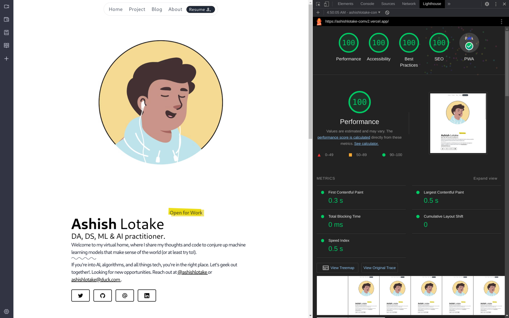

# Portfolio

This is my version 2 of my <a href="https://ashishlotake.com/" target="_blank">portfolio website</a> built with <a href="https://https://astro.build/" target="_blank">Astro</a>, <a href="https://tailwindcss.com/" target="_blank">Tailwind CSS</a> and hosted with <a href="https://www.vercel.com/" target="_blank">Vercel</a>.<br>
For [Version 1](https://github.com/ashishlotake/ashishlotake.com) viist the [github repo](https://github.com/ashishlotake/ashishlotake.com) which is </a> built with <a href="https://nextjs.org/" target="_blank">Next.js</a> and <a href="https://tailwindcss.com/" target="_blank">Tailwind CSS</a>.

### Why Astro ?

Astro is the all-in-one frontend framework designed for speed, Astro optimizes the website like no other framewor. It use 100% Static HTML, No JS, with on-demand Components and its supports TypeScript, Scoped CSS, CSS Modules, Sass, Tailwind, Markdown, MDX, and any of your favorite npm packages.

> _There’s a simple secret to building a faster website — just ship less._

## Perfect Light House Score with Full PWA support



---

## 🛠 Installation & Set Up

### 1. Clone this repository

```bash
git clone https://github.com/ashishlotake/portfoliov2.git
```

### 2. Install Dependencies

```bash
npm install
# or
yarn install
# or (recommended)
pnpm install
```

### 3. Start development Server

```bash
npm run dev
# or
yarn dev
# or (recommended)
pnpm dev
```

### 4. Preview & Build

```bash
npm run preview
npm run build
# or
yarn preview
yarn build
# or (recommended)
pnpm preview
pnpm build
```

We recommend using [pnpm](https://pnpm.io/) to save disk space on your computer.

### 5. Other Commands

```bash
pnpm astro ...
pnpm astro add
pnpm astro --help
```

## Project Structure

Inside of your Astro project, you'll see the following folders and files:

```
/
├── public/
│   └── ...
├── src/
│   ├── components/
│   │   └── ...
│   ├── layouts/
│   │   └── ...
│   └── pages/
│       └── ...
└── package.json
```

Astro looks for `.astro` or `.md` files in the `src/pages/` directory. Each page is exposed as a route based on its file name.

Any static assets, like images, can be placed in the `public/` directory.

---

## Credits

### Template

This [portfolio](https://ashishlotake.com) is create using [Web3Templates Template](https://github.com/surjithctly/astroship)

### Source graphics are used

1. [https://undraw.co/search](https://undraw.co/search)
2. [https://freesvgillustration.com/illustrations/](https://freesvgillustration.com/illustrations/)
3. [https://www.manypixels.co/gallery](https://www.manypixels.co/gallery)
4. [Free SVG Vectors](https://bloggingwizard.com/free-vector-illustrations/)

```html
<SEO title="A Very Descriptive Title" description="A heavily optimized
description full of well-researched keywords." openGraph={{ basic: { title: "A
Very Descriptive Title", type: "A type.", image: "Image", } }} twitter={{
creator: "@jonasmerlins1" }} />
```
